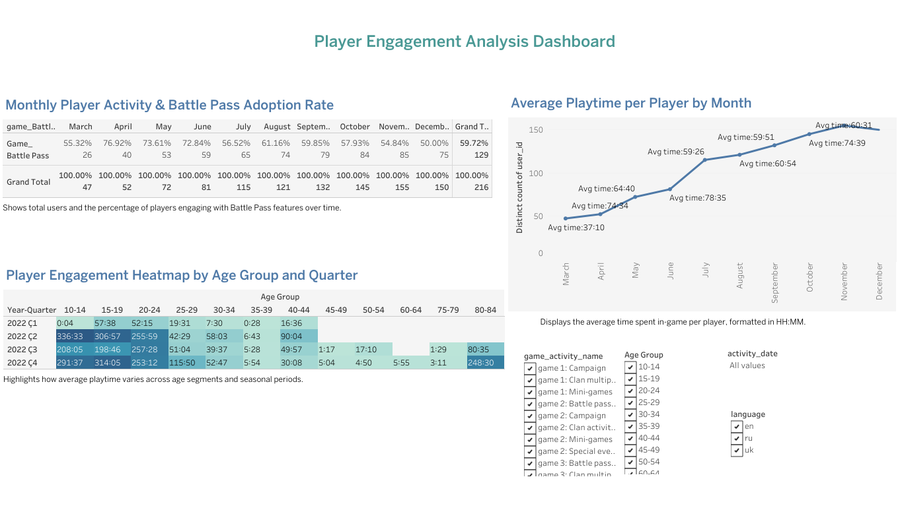

# game-analytics-tableau-dashboard
📌 Project Overview
-This project analyzes player behavior and engagement in a game dataset using Tableau.

The dashboard focuses on:
-Average playtime per player
-Monthly trends in engagement
-Age-based behavioral differences
-Seasonal (quarterly) patterns

🔗 Live Dashboard:
https://public.tableau.com/app/profile/i.pek.akdeniz/viz/GameAnalyticsDashboard_17762616061780/Dashboard1?publish=yes 

📊 Key Insights
-Player engagement varies significantly across age groups
-Certain quarters show higher average playtime
-Younger and mid-age segments display different usage patterns

🛠️ Tools & Technologies
-Tableau Public
-Data Visualization
-Calculated Fields (Time Formatting, Age Binning)

🔍 Data Preparation
-Converted total seconds into HH format
-Created age groups in 5-year intervals (e.g., 20–24, 25–29)
-Derived Year-Quarter format (e.g., 2022 Q1)

📈 Visualizations
📅 Monthly average playtime per player
🔥 Heatmap of playtime by age group and quarter
📊 KPI-style time labels (HH format)

📷 Dashboard Preview

💡 What I Learned
-Building interactive dashboards in Tableau
-Creating meaningful calculated fields
-Translating raw data into business insights

🚀 Future Improvements
-Add cohort analysis
-Include retention metrics
-Connect to live data sources
